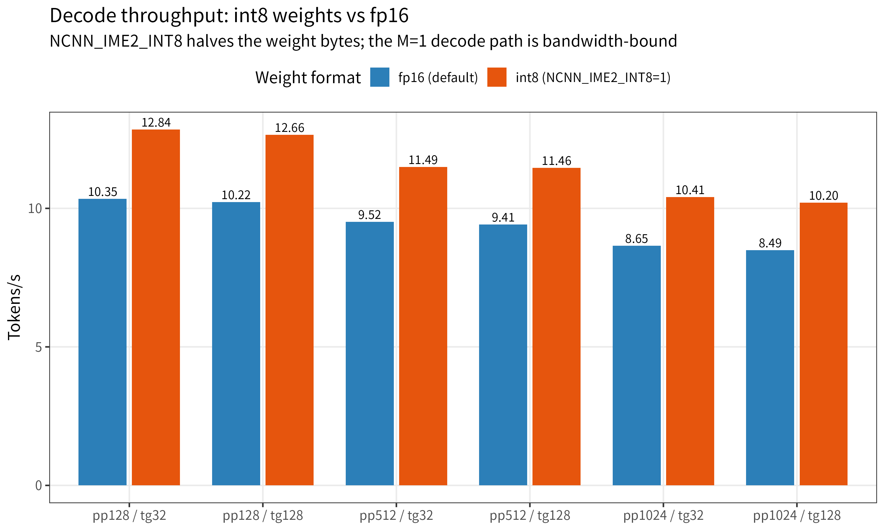
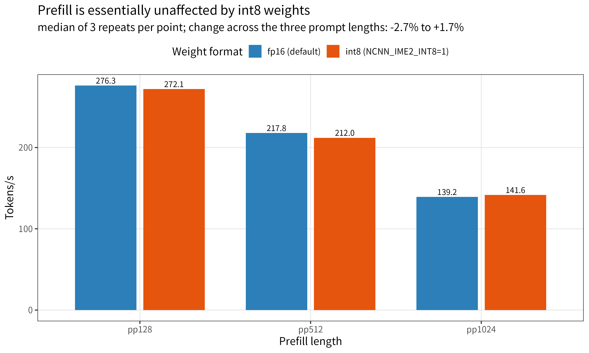
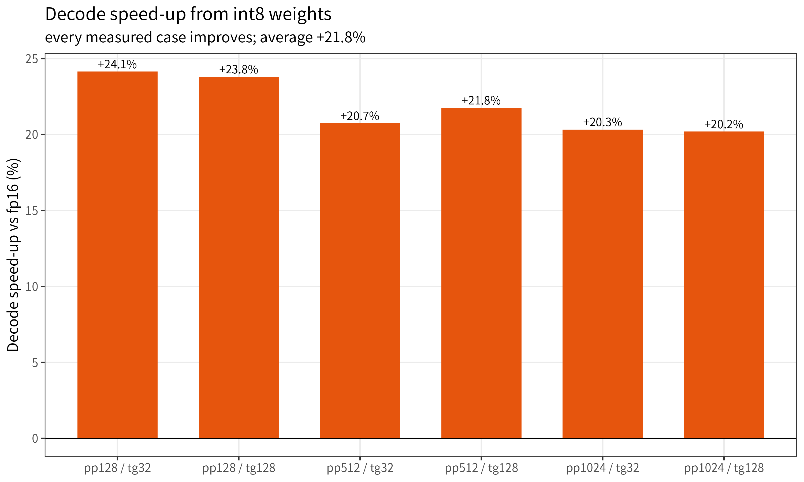

<p align="center">
  
</p>

<h1 align="center">ncnn_llm</h1>

<p align="center">
  <b>LLM, VLM, OCR, discriminator, and embedding inference on top of ncnn.</b>
</p>

<p align="center">
  <a href="LICENSE"></a>
  
  
  
</p>

<p align="center">
  <a href="README_CN.md">中文文档</a>
  ·
  <a href="#quick-start">Quick Start</a>
  ·
  <a href="#supported-models">Supported Models</a>
  ·
  <a href="#model-zoo">Model Zoo</a>
</p>

---

`ncnn_llm` provides a lightweight C++ runtime for running language models and embedding models with [ncnn](https://github.com/Tencent/ncnn). It focuses on practical local inference for edge devices, desktop CPU, and Vulkan-capable GPUs.

The project started from **nihui's** experimental ncnn `kvcache` work and expands it into reusable examples, model loaders, tokenizers, vision preprocessing, OCR inference, and embedding APIs.

## Highlights

- Unified CLI runner for chat and vision-language models
- KV-cache autoregressive decoding with CPU and optional Vulkan execution
- Qwen / MiniCPM style LLM support
- Qwen VL image input support
- GLM-OCR image-to-text example
- Laya / Laya-Multilingual fast decision discriminator example
- Text and multimodal embedding APIs
- BPE and Unigram tokenizer support
- CMake project management with standalone examples and CTest integration
- High-performance custom operators (GatedDeltaRule & ShortConv) conforming to formal ncnn operator architecture with workspace/blob allocator memory pooling and AVX-512 / AVX / SSE SIMD acceleration

## Supported Models

| Category | Model | Status | Notes |
| --- | --- | --- | --- |
| LLM | YoutuLLM | Supported | Chat / text generation |
| LLM | MiniCPM4 | Supported | Chat / text generation |
| LLM | MiniCPM5 | Supported | Chat, reasoning, and XML tool calls |
| LLM | Qwen3 | Supported | Chat / text generation |
| LLM | Qwen3.5 | Supported | Hybrid attention with GatedDeltaRule and ShortConv |
| VLM | Qwen2.5-VL | Supported | Image + text input |
| VLM | Qwen3.5-VL | Supported | Image + text input with mRoPE |
| OCR | GLM-OCR | Supported | OCR |
| OCR | HunyuanOCR | Supported | OCR |
| ASR | Qwen3 ASR | Supported | ASR |
| Discriminator | Laya / Laya-Multilingual | Supported | System 1 fast decision engine (intent choice/scoring/RL escalation) |
| Embedding | Jina-Embeddings-v5-Text-Nano | Supported | 768-dim text embeddings |
| Embedding | Jina-CLIP-v2 | Supported | 1024-dim text + image embeddings |

## Quick Start

### 1. Requirements

- C++20 compatible compiler (MSVC 2019+, GCC 10+, Clang 11+)
- CMake >= 3.15
- Vulkan SDK (optional, for Vulkan GPU acceleration)

### 2. Clone

Clone repository with submodules (ncnn bundled as submodule, following LiteOCR / wan-ncnn-vulkan conventions):

```bash
git clone --recursive https://github.com/futz12/ncnn_llm.git
cd ncnn_llm
```

Or if cloned without `--recursive`:

```bash
git submodule update --init --recursive
```

### 3. Build

```bash
# Configure project (options: -DNCNN_LLM_ENABLE_VULKAN=ON/OFF, -DNCNN_LLM_ENABLE_TOOLS=ON/OFF)
cmake -B build -DCMAKE_BUILD_TYPE=Release -DNCNN_LLM_ENABLE_VULKAN=ON

# Build
cmake --build build --config Release -j

# Run tests
ctest --test-dir build -C Release --output-on-failure
```

Build a single target (e.g. `llm_ncnn_run`):

```bash
cmake --build build --config Release --target llm_ncnn_run
```

### 4. Download Models

Download converted ncnn model directories from the mirror:

https://mirrors.sdu.edu.cn/ncnn_modelzoo/

Put the model directory under `assets/`, for example:

```text
assets/
└── qwen3_0.6b/
    ├── model.json
    ├── *.ncnn.param
    ├── *.ncnn.bin
    └── tokenizer files
```

## CLI Chat

`llm_ncnn_run` is the main interactive example for text and vision-language models.

```bash
./build/llm_ncnn_run --model ./assets/qwen3_0.6b
```

With explicit runtime options:

```bash
./build/llm_ncnn_run --model ./assets/qwen3_0.6b --threads 4
./build/llm_ncnn_run --model ./assets/qwen3_0.6b --vulkan --vulkan-device 0
```

Vision-language input:

```bash
./build/llm_ncnn_run --model ./assets/qwen2.5_vl_3b --image ./assets/test.jpg
```

### CLI Options

| Option | Description |
| --- | --- |
| `--model <path>` | Model directory (default: `./assets/qwen3_0.6b`) |
| `--threads <num>` | Number of CPU threads (default: auto) |
| `--use-vulkan` | Enable Vulkan GPU compute (`--vulkan` also accepted) |
| `--vulkan-device <index>` | Vulkan device index (default: `0`) |
| `--image <path>` | Input image path for vision-language (VL) models |
| `--max-new-tokens <num>` | Maximum generated tokens (default: `512`) |
| `--enable-thinking` | Enable model reasoning output (`<think>...</think>`) |
| `--no-builtin-tools` | Disable built-in demo tools (calculator/random) |

Example session:

```text
llm_ncnn_run (cli). Type 'exit' or 'quit' to end the conversation.
User: Hello
Assistant: Hello! How can I help you today?
```

## Model Quantization (INT8 Block Quantization)

`ncnn_llm` supports INT8 quantization inference based on ncnn's latest Gemm block quant feature. By quantizing the Decoder weights (while keeping the LM Head / Proj Out in original precision to ensure generation quality), memory usage is significantly reduced and CPU decoding throughput is greatly improved.

Taking Qwen3-0.6B as an example (Intel i9-13900HX):
- **Size Compression**: Decoder weight reduced from 840 MB to 446 MB (~47% reduction).
- **Speedup**: CPU decoding speed increased from 17.0 tokens/s to 32.0 tokens/s (+71.9%), Prefill latency reduced by 42%.
- **Generation Quality**: Output is identical to the unquantized model without precision loss.

### Exporting Quantized Model

Quantize using ncnn's built-in tool (the script automatically locates the compiled `ncnnllm2int` tool):

```bash
# Automatically quantize a single model directory
python export/quantize_model.py --model ./assets/qwen3_0.6b --output ./assets/qwen3_0.6b_int8 --bits 8 --block 64

# Or batch quantize all models found in assets directory
python export/quantize_model.py --all --bits 8 --block 64

# Or quantize single param / bin files directly
ncnnllm2int decoder.ncnn.param decoder.ncnn.bin decoder_int8.ncnn.param decoder_int8.ncnn.bin bits=8 block=64 method=minmax
```

### Running Quantized Model

```bash
./build/llm_ncnn_run --model ./assets/qwen3_0.6b_int8 --threads 8
```
> Note: Gemm weight block quantization currently provides optimized vectorized kernels on the CPU backend (AVX2 / AVX-VNNI / ARM, etc.). The runtime will automatically execute quantized layers on CPU.

### SpaceMiT K3: IME2 int8 weight mode (`NCNN_IME2_INT8=1`)

On SpaceMiT K3 (A100 cluster, `smt.vfwmadot` IME2), the IME2 Gemm path can hold its weights
as **int8 with one fp16 scale per column** instead of fp16. This keeps the integer-domain
product in the IME2 unit and halves the weight bytes, which matters most for the
**bandwidth-bound M=1 decode path**.

```bash
# decode-optimised: int8 weights
NCNN_IME2_INT8=1 ai-run ./build/ncnn_llm_server --model assets/qwen3_0.6b --threads 8 --port 9200
```

Measured with llama-benchy 0.4.0 (Qwen3-0.6B, threads=8, A100 cluster cpu8-15, runs=3,
freshly rebuilt clang 24 binary; both configurations measured in the same session):

| case | fp16 (default) | int8 | change |
|---|---|---|---|
| tg32 @ pp128 | 10.35 t/s | **12.84 t/s** | **+24.1%** |
| tg128 @ pp128 | 10.22 t/s | **12.66 t/s** | **+23.8%** |
| tg32 @ pp512 | 9.52 t/s | **11.49 t/s** | **+20.7%** |
| tg128 @ pp512 | 9.41 t/s | **11.46 t/s** | **+21.8%** |
| tg32 @ pp1024 | 8.65 t/s | **10.41 t/s** | **+20.3%** |
| tg128 @ pp1024 | 8.49 t/s | **10.20 t/s** | **+20.2%** |
| pp128 | 276.31 t/s | 272.07 t/s | ~flat (-1.5%) |
| pp512 | 217.82 t/s | 211.99 t/s | ~flat (-2.7%) |
| pp1024 | 139.24 t/s | 141.57 t/s | ~flat (+1.7%) |

> The two pp=128 rows are **medians of 3 independent repeats** (per-round spread
> < 2%); the rest are single `--runs 3` results. Within one `--pp`, the `tg32` and
> `tg128` rows should report a similar prefill figure; a row that deviates clearly
> is a measurement outlier (one such point was re-measured 3 times and is excluded
> here).

* **Decode: +20.2% .. +24.1%** in every measured case (average **+21.8%**).
* **Prefill: essentially flat** (-2.7% .. +1.7%, within measurement noise) - halving the
  weight bytes mostly helps the bandwidth-bound M=1 decode path; the compute-bound long
  prefill is largely unaffected.
* **Coherence test PASSED for both configurations** (llama-benchy factual Q&A check), and
  generated text is identical to the fp16 path in our runs.

Charts (measured, not modelled):







> The mode is **opt-in and off by default**; the fp16 path is byte-identical whether or not
> the variable is set. int8 is a good default for interactive/decoding use; long-prompt
> prefill is essentially unaffected.
>
> The command above uses `ncnn_llm_server`, which is introduced by PR #50. If #50 has not
> landed yet, use an existing entry point (`benchllm`, `k3bench`, ...) with the same
> environment variable.

## OCR

GLM-OCR uses a dedicated image prefill path and the shared text decode runtime.

```bash
cmake --build build --config Release --target ocr_main
./build/ocr_main --model ./assets/glm_ocr --image ./test_ocr.png --prompt "Read the text in the image."
```

Example output:

```text
Generating text:
Hello World 123
```

## Discriminator / Fast Decision (Laya)

`ncnn_llm_laya` supports Convai's **Laya** (ModernBERT-large based) and **Laya-Multilingual** (mmBERT-base based) discriminators. Each model is split into three ncnn submodels, `backbone`, `scorer`, and `act_head`, for System 1 intent classification, scoring, and RL agent escalation.

### Model Export

```bash
# Download the Hugging Face source model to a local directory first
huggingface-cli download convaiinnovations/laya --local-dir ./models/laya

# Export English Laya (BF16 & INT8 block quantization)
python export/laya_export.py --model-dir ./models/laya --output-dir ./assets/laya --int8-dir ./assets/laya_int8

# Download and export Laya-Multilingual
huggingface-cli download convaiinnovations/laya-multilingual --local-dir ./models/laya_multilingual
python export/laya_export.py --model-dir ./models/laya_multilingual --output-dir ./assets/laya_multilingual --int8-dir ./assets/laya_multilingual_int8
```

`--model-dir` must point to a downloaded local source model containing `rl_agent_api.py` and `tokenizer/`.

### CLI Inference

```bash
cmake --build build --config Release --target laya_main

# Run INT8 quantized multilingual discriminator
./build/laya_main --model ./assets/laya_multilingual_int8 --json ./examples/laya_multilingual_request.json --threads 4
```

### C++ API

```cpp
#include "ncnn_llm_laya.h"

ncnn_llm_laya laya("./assets/laya_multilingual_int8", false, 4, 0, true);

std::string state = "My package arrived broken and damaged, and the courier was rude. I demand an immediate refund!";
nlohmann::json questions = {
    {"intent", {
        {"type", "choice"},
        {"instructions", "Identify primary user intent"},
        {"criteria", {
            {"refund", "Asking for refund or compensation"},
            {"logistics", "Tracking package status"}
        }}
    }},
    {"urgent", {
        {"type", "noul"},
        {"instructions", "Is the user very angry requiring urgent escalation?"}
    }}
};

nlohmann::json res = laya.system_one_json(state, questions);
std::cout << res.dump(2) << std::endl;
```

## Embeddings

`ncnn_embedding` provides a common API for text embeddings and CLIP-style text-image embeddings.

### Text Embedding

```bash
cmake --build build --config Release --target embedding_main
./build/embedding_main --model ./assets/jina-embeddings-v5-text-nano
```

### CLIP Multimodal Embedding

```bash
cmake --build build --config Release --target clip_main
./build/clip_main --model ./assets/jina_clip_v2 --image ./assets/ganyu.jpg
```

### C++ API

```cpp
#include "ncnn_embedding.h"

ncnn_embedding embed("./assets/jina_clip_v2", false, 4);

std::vector<float> text_vec = embed.encode_text("Hello world");

if (embed.supports_image()) {
    std::vector<float> image_vec = embed.encode_image_file("./image.jpg");
    float score = cosine_similarity(text_vec, image_vec);
}
```

## Other Examples

| Target | Purpose |
| --- | --- |
| `llm_ncnn_run` | Unified chat / VL CLI |
| `ocr_main` | GLM-OCR inference |
| `embedding_main` | Text embedding inference |
| `clip_main` | CLIP text-image embedding inference |
| `laya_main` | Laya / Laya-Multilingual discriminator inference |
| `benchllm` | LLM benchmark (exact prefill tokens/s & decode ms/tok) |
| `bench_qwen35` | Qwen3.5 linear attention (GDR & ShortConv) benchmark |
| `test_llm` | Unit tests |
| `test_bf16` | BF16 tests |
| `test_kernel` | GDR and ShortConv kernel memory pool & SIMD unit tests |

Run tests:

```bash
ctest --test-dir build -C Release --output-on-failure
```

Run benchmark:

```bash
cmake --build build --config Release --target benchllm
./build/benchllm [loop_count] [threads] [powersave] [gpu_device] [cooling_down] [pp] [tg]
```

## Model Zoo

Converted ncnn model weights are available from:

https://mirrors.sdu.edu.cn/ncnn_modelzoo/

Each downloaded model directory should contain `model.json`, ncnn param/bin files, and tokenizer files. Put the directory under `assets/` or pass its path with `--model`.

## Configuration

Each model directory is described by `model.json`. The exact fields depend on the model family, but a typical text model contains:

```json
{
  "model_type": "llm",
  "params": {
    "embed_param": "embed.ncnn.param",
    "embed_bin": "embed.ncnn.bin",
    "decoder_param": "decoder.ncnn.param",
    "decoder_bin": "decoder.ncnn.bin",
    "lm_head_param": "lm_head.ncnn.param",
    "lm_head_bin": "lm_head.ncnn.bin"
  },
  "tokenizer": {
    "type": "bbpe",
    "vocab_file": "vocab.txt",
    "merges_file": "merges.txt"
  },
  "setting": {
    "attn_cnt": 32,
    "hidden_size": 1024,
    "rope": {
      "type": "RoPE",
      "rope_head_dim": 64,
      "rope_theta": 1000000.0
    }
  }
}
```

Embedding and OCR models use their own `model_type` and parameter sections. See the model files under `assets/` for concrete examples.

## Project Layout

```text
ncnn_llm/
├── CMakeLists.txt          # CMake project configuration
├── cmake/                  # CMake dependency modules (deps_ncnn, deps_json)
├── ncnn/                   # Upstream ncnn submodule (official operator runtime)
├── assets/                 # Local model directories and demo assets
├── benchmark/              # Benchmark entry points
├── examples/               # CLI and feature examples
│   ├── llm_ncnn_run/       # Unified chat / VL runner
│   ├── ocr_main.cpp        # OCR example
│   ├── embedding_main.cpp  # Text embedding example
│   ├── clip_main.cpp       # CLIP example
│   ├── laya_main.cpp       # Laya discriminator example
│   └── asr_main.cpp        # ASR example
├── export/                 # Export scripts
├── src/                    # Core runtime
│   ├── kernel/             # Custom operators (GatedDeltaRule, ShortConv with workspace/blob allocators)
│   │   └── x86/            # SIMD kernels (direct inclusion of ncnn layer headers)
│   ├── ncnn_llm_gpt.*      # LLM / VL runtime
│   ├── ncnn_llm_laya.*     # Laya discriminator runtime
│   ├── ncnn_llm_ocr.*      # OCR image prefill + shared decode
│   ├── ncnn_embedding.*    # Embedding runtime
│   ├── ncnn_text_runtime.* # Shared text decode helpers
│   └── utils/              # Tokenizer, image, RoPE, prompt helpers
├── tests/                  # Unit and kernel tests (test_kernel, test_llm, test_bf16)
```

## Roadmap

- Keep decoder and KV-cache runtime shared across model families
- Expand supported model architectures and tokenizers
- Improve Vulkan and CPU performance
- [x] Add INT8 quantization support (Gemm Block Quantization)
- Document model export pipelines in more detail

Older export scripts may become outdated as the runtime evolves. Prefer the latest model examples and `model.json` files as references.

## Community

Issues, fixes, converted models, and test results are welcome.

- QQ group: `767178345`

## License

Apache License 2.0. See [LICENSE](LICENSE).
